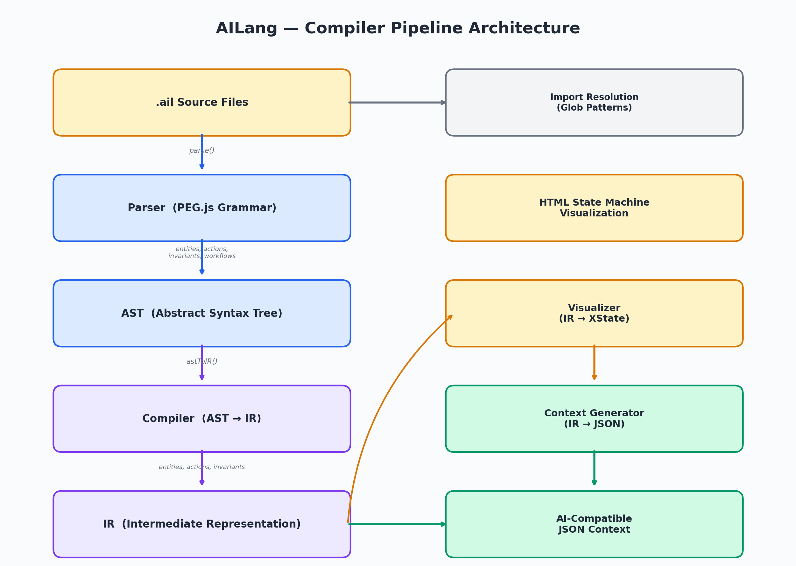
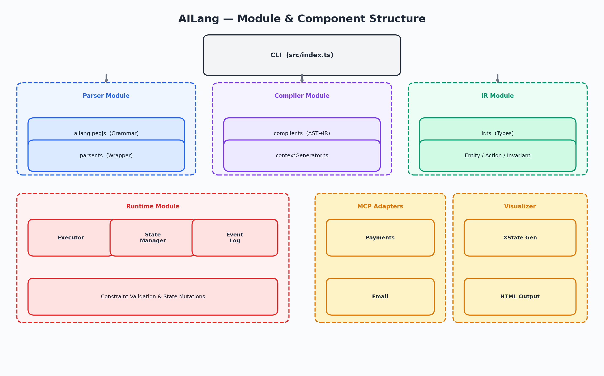
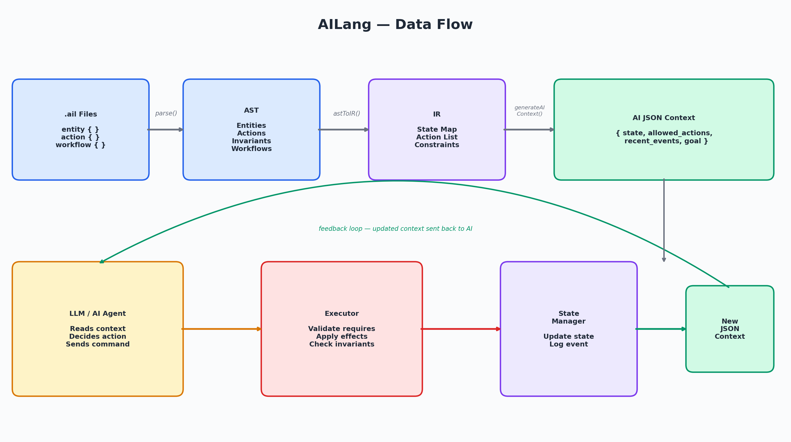
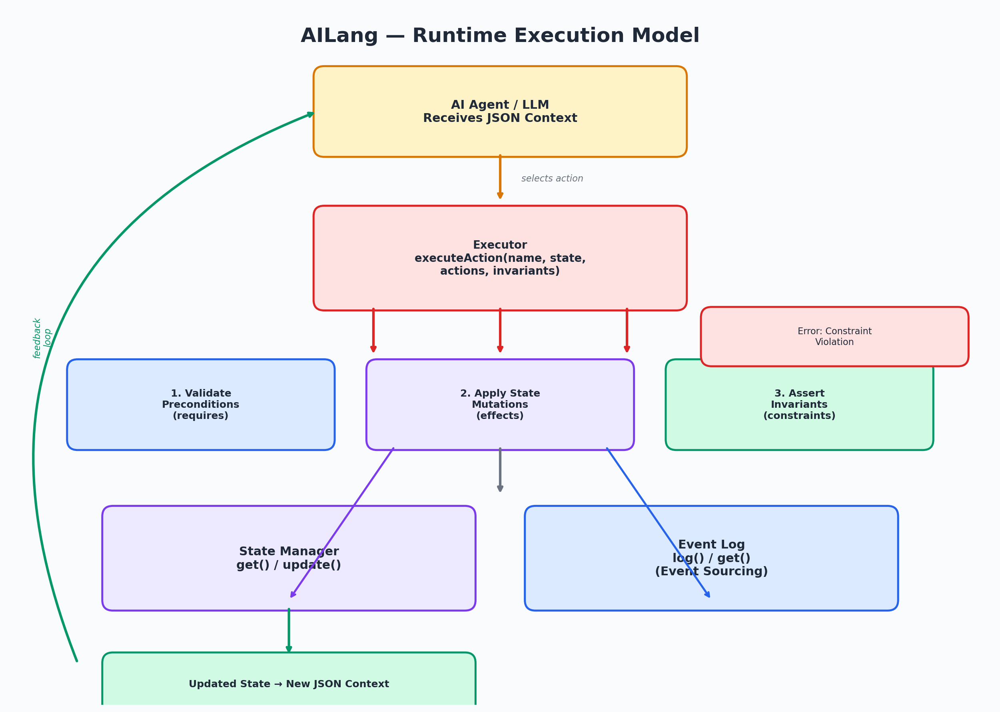

# AILang — DSL Compiler for AI Workflows

A TypeScript compiler for **AILang** (`.ail`), a domain-specific language for defining stateful workflows and state machines that AI agents can understand and execute.

Write declarative workflow specs in AILang → compiler produces structured AI-compatible context that LLMs and MCP-based agents can reason over.

## Architecture

### Compiler Pipeline

The core of AILang is a classic compiler pipeline: `.ail` source files are parsed via a PEG.js grammar into an AST, compiled into an Intermediate Representation (IR), and then output as either AI-compatible JSON context or HTML state machine visualizations.



### Module & Component Structure

AILang is organized into six main modules — Parser, Compiler, IR, Runtime, MCP Adapters, and Visualizer — all orchestrated through the CLI entry point.



### Data Flow

Data flows left-to-right through the compiler pipeline, then enters a runtime feedback loop where the AI agent reads context, selects actions, and the executor updates state for the next cycle.



### Runtime Execution Model

When an AI agent selects an action, the executor validates preconditions, applies state mutations, asserts invariants, and feeds the updated context back to the agent.



## AILang Syntax

```ailang
entity Todo {
  id: string
  title: string
  status: PENDING | IN_PROGRESS | DONE
}

action StartTodo {
  requires Todo.status == PENDING
  effects Todo.status = IN_PROGRESS
}

action CompleteTodo {
  requires Todo.status == IN_PROGRESS
  effects Todo.status = DONE
}

invariant Todo.status == DONE implies true
```

See [examples/](./examples/) for more — including a full multi-module [employee onboarding workflow](./examples/employee-onboarding/).

## Quick Start

```bash
npm install
npm run dev                       # run with default examples/todo.ail
npm run dev -- examples/multi-domain.ail
```

## Build

```bash
npm run build   # tsc → dist/
npm start       # run compiled output
```

## Project Structure

```
src/
├── index.ts               # CLI entry point
├── parser/
│   ├── ailang.pegjs       # PEG.js grammar for AILang
│   └── parser.ts          # Parser wrapper
├── ir/
│   └── ir.ts              # Intermediate representation types
├── compiler/
│   ├── compiler.ts        # AST → IR
│   └── contextGenerator.ts # IR → AI-compatible JSON context
├── runtime/
│   ├── executor.ts        # Action executor
│   ├── stateManager.ts    # State transitions
│   └── eventLog.ts        # Event sourcing log
├── mcp/
│   └── adapters.ts        # Model Context Protocol stubs
└── visualizer.ts          # Workflow visualizer
examples/
├── todo.ail               # Simple todo state machine
├── multi-domain.ail       # Multi-entity workflow
└── employee-onboarding/   # Multi-module real-world workflow
    ├── employee/
    ├── accounts/
    ├── documents/
    ├── equipment/
    ├── meetings/
    └── training/
```

## Tech Stack

- **TypeScript** 4.9
- **PEG.js** — parser generator (grammar-based parsing)
- **ts-node** — development runner
